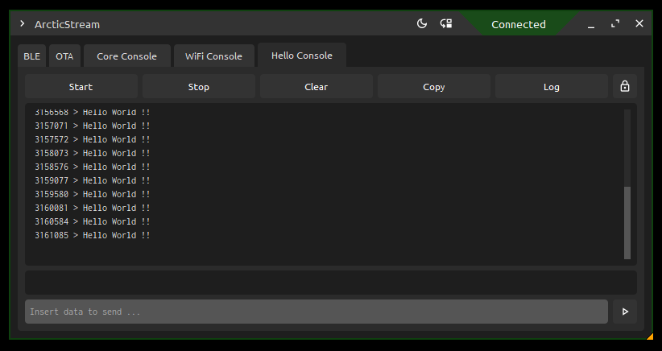
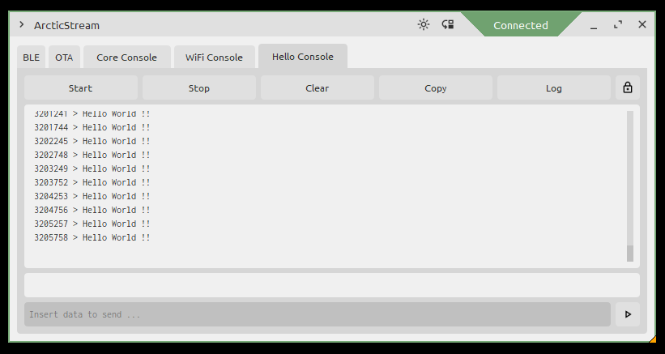

# ArcticStream

ArcticStream is a Python-based visualizer designed for integration with the [ArcticTerminal](https://github.com/SlimeCodex/ArcticTerminal) library for ESP32. It uses PyQt5 to create a GUI application that allows users to interact with BLE devices, update their firmware, and customize the window properties.

<div style="text-align: center;">
    <p style="display: inline-block;">
		
		
    </p>
</div>

## Development Status Warning

⚠️ **Important Notice: Project in Development** ⚠️

Please be aware that this project is currently under active development. While efforts are made to ensure reliability and stability, potential failures and unexpected behaviors may occur, particularly under certain untested conditions.

### Current Testing Status
- **Operating System**: Primarily tested on Windows 11 OS. It has also been successfully tested on Raspberry Pi 4 and MacBook Pro (Sonoma 14.1) by manually running the scripts (using Python). Compatibility with other operating systems or OS versions may not be fully verified and could potentially encounter issues.

### User Discretion Advised
Users should exercise caution when using this application, keeping in mind its developmental status. Feedback, bug reports, and contributions to enhance stability and functionality are greatly appreciated.

### Future Updates
Regular updates and improvements are planned as the project progresses. Stay tuned for more robust and stable versions in the future.

# Project Overview

This project introduces a comprehensive BLE (Bluetooth Low Energy) application, primarily designed for the ESP32 platform. It's engineered with an eye towards future expansions, potentially encompassing other platforms like NRF, Raspberry Pi, and more. The application is rich in features, tailored for enhanced interaction with microcontroller units (MCUs).

## Key Features

### BLE Capabilities
- **GATT Protocol**: Leverages the Generic Attribute Profile (GATT) for efficient BLE communication.
- **OTA Updates**: Supports Over-The-Air (OTA) firmware updates via BLE, capable of achieving speeds up to 19kb/s under optimal conditions.

### Console Management
- **Dynamic Console Creation**: Facilitates on-demand creation of consoles based on server-side (MCU) requirements.
- **Auto Reconnection**: Automatically re-establishes connection following MCU resets.
- **Multiple Consoles**: Supports up to 15 consoles, allowing extensive monitoring and control (note: not fully tested).
- **Low Latency**: Achieves as low as 2ms latency in ideal scenarios.

### User Interface
- **Theme Customization**: Offers both dark and light color themes, switchable with a single click.
- **Console Features**: Each console includes Start, Stop, Clear, and Copy functions for the entire console buffer.
- **Log Types**: Supports Multiline and Single Line logs, ideal for status information or animations.
- **Independent Text Input**: Each console features an independent text input box for sending data to the device, ensuring command isolation among consoles.

### OTA Specific Features
- **Drag and Drop**: Simplifies the firmware update process with a drag-and-drop interface.
- **Firmware Management**: Allows users to Start, Stop, Clear, and Reload selected local firmware, streamlining the development cycle.

# Python Implementation

### Main Window

Defined in `main_window.py`, the main window initializes with a default title and size, incorporates a custom stylesheet and fonts, and sets up a layout with a tab widget and a line edit for debug information. Key functionalities include handling BLE connections, dynamically adding tabs, updating tab titles, managing the status bar, and handling window resizing and closing events.

### Connection Window

Located in `connection_window.py`, this window facilitates scanning and connecting to BLE devices. It features a list widget for displaying scanned devices and buttons for initiating scans, establishing connections, and exiting. Additional functions cover device discovery, managing connections, and characteristic reading.

### Console Window

The console window, defined in `console_window.py`, acts as an interactive interface with a BLE device. It includes a text area for data display, a line edit for sending data, and buttons for various commands. It handles incoming BLE device notifications, updates tab titles, and processes Enter key presses in the data input field.

### OTA Updater

`ota_updater.py` houses the OTA updater, providing a UI for firmware updates over BLE. It includes a display for update progress, a progress bar, and buttons for firmware selection, update initiation, and exit. The module manages update processes, device disconnection, and characteristic writing.

### Window Properties

`window_properties.py` manages the customization of window properties. It features a custom title bar with various controls and functions for setting this bar, determining resize direction, adjusting cursor, resizing and moving the window, and handling diverse window events.

## Getting Started

This section provides instructions on how to set up ArcticStream on your local machine for development and testing purposes.

# Pre-Built Executable
For quick access to the application, a pre-built executable is available in the `build` folder. You can run this executable to start the application without having to install any dependencies or run any scripts.

# Dependencies
ArcticStream is built with Python and relies on several packages. Before running the application from source, ensure you have Python installed on your machine. If not, you can install it using pip:

```bash
pip install python
```

Once Python is installed, you will need to install the following mandatory dependencies:

```bash
pip install pyqt5
pip install bleak
pip install qasync
```

These packages provide the necessary modules for the GUI, BLE handling, and asynchronous operations.

If you plan on generating your own executables, you will also need to install `pyinstaller`:

```bash
pip install pyinstaller
```

# Running the Application

After installing the necessary dependencies, you can run the application by executing the main.py script located in the src folder:

```bash
python main.py
```

This will start the application and open the main window.

## Contributing

Contributions are welcome! For guidelines on how to contribute, please refer to the contributing guide (WIP).

## License

ArcticStream is licensed under the GNU General Public License v3.0. For more details, see the [LICENSE](LICENSE) file in this repository.