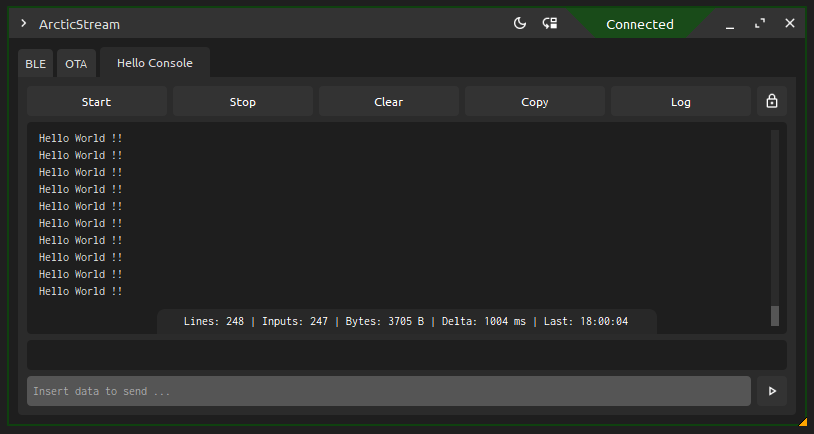
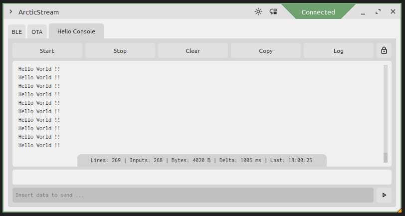

# ArcticStream

ArcticStream is a versatile, Python-based visualizer, seamlessly integrated with the [ArcticTerminal](https://github.com/SlimeCodex/ArcticTerminal) library for ESP32. At its core, ArcticStream is thread-safe, multi-console GUI application, crafted using PyQt5, that offers a comprehensive suite of functionalities for interacting with your ESP32 wirelessly through Bluetooth.

<div style="text-align: center;">
    <p style="display: inline-block;">
		
		
    </p>
</div>

# Quick Start

## Important Issue
Before attempting to establish a connection with your device using ArcticStream, it is crucial to not pair the device with your operating system (especially in Windows environments). If the ESP32 device is already paired through the operating system's Bluetooth settings and you try to connect to it via ArcticStream, you may experience persistent connection issues. Specifically, the program might continuously connect and disconnect without providing a clear explanation.

## Windows Users (pre-build)
For quick access to the application, a pre-built executable is available in the [Builds](https://github.com/SlimeCodex/ArcticStream-Builds) repository. In theory, you should be able to run this executable to start the application without having to install any dependencies or run any scripts.

## Linux or Mac Users (source)
If the `Quick Start` didn't worked for you or if using Linux or Mac, please refer to the [Getting Started](#getting-started) section for detailed instructions on how to set up and run the project.

# Project Overview

This project introduces a comprehensive BLE (Bluetooth Low Energy) application, primarily designed for the ESP32 platform. It's engineered with an eye towards future expansions, potentially encompassing other platforms like nRF, Raspberry Pi, and more.

### Multi-Console Interface
Offers the ability to manage multiple consoles (supports with ease up to 16 consoles) for each connected device, enabling detailed and segmented monitoring and interaction within a single BLE device environment. Just initialize any terminals in your ESP32 with a few lines and done!

### OTA Update Support
Facilitates Over-The-Air (OTA) firmware updating capabilities through BLE, tailored for precise and efficient software deployment to devices. This feature should be capable of achieving speeds up to 19kb/s under optimal conditions.

### Reconnection Management
Efficiently addresses reconnections, maintaining steadfast communication links, particularly after device resets or interruptions.

### Individual Upstream/Downstream for Each Console
Each console in ArcticStream is equipped with its own input and output channels, allowing for isolated and specific interactions within the device's different functions or modules.

### User-Friendly Design
Balances simplicity and functionality, offering a lightweight, portable, and straightforward user interface.

### Cross-Platform Functionality
Designed to operate consistently across various operating systems, enhancing its utility in diverse computing environments.

### Standalone Executable Application
The project includes a standalone executable application for Windows OS. This means you don't necessarily need to install any dependencies or learn Python to use it. Simply run the executable file and the application will start. Please note that as of now, this standalone executable is only available for Windows OS. I am working on providing similar solutions for other operating systems.

## ⚠️ Development Status Warning ⚠️
Please be aware that this project is currently under active development. While efforts are made to ensure reliability and stability, potential failures and unexpected behaviors may occur, particularly under certain untested conditions.

### Current Testing Status
Primarily tested on Windows 11 OS. It has also been successfully tested on Raspberry Pi 4 and MacBook Pro (Sonoma 14.1) by manually running the scripts (using Python). Compatibility with other operating systems or OS versions may not be fully verified and could potentially encounter issues.

### User Discretion Advised
Users should exercise caution when using this application, keeping in mind its developmental status. Feedback, bug reports, and contributions to enhance stability and functionality are greatly appreciated. This project is my first step into collaborative development. I've never before contributed to an active, public project, and I'm excited to learn and grow through this experience.

### Future Updates
Regular updates and improvements are planned as the project progresses.

# Python Implementation

### Main Window
Defined in `main_window.py`, the main window initializes with a default title and size, incorporates a custom stylesheet and fonts, and sets up a layout with a tab widget and a line edit for debug information. Key functionalities include handling BLE connections, dynamically adding tabs, updating tab titles, managing the status bar, and handling window resizing and closing events.

### Connection Window
Located in `connection_window.py`, this window facilitates scanning and connecting to BLE devices. It features a list widget for displaying scanned devices and buttons for initiating scans, establishing connections, and exiting. Additional functions cover device discovery, managing connections, and characteristic reading.

### Console Window
The console window, defined in `console_window.py`, acts as an interactive interface with a BLE device. It includes a text area for data display, a line edit for sending data, and buttons for various commands. It handles incoming BLE device notifications, updates tab titles, and processes Enter key presses in the data input field.

### OTA Updater
`ota_updater.py` houses the OTA updater, providing a UI for firmware updates over BLE. It includes a display for update progress, a progress bar, and buttons for firmware selection, update initiation, and exit. The module manages update processes, device disconnection, and characteristic writing.

### Window Properties
`window_properties.py` manages the customization of window properties. It features a custom title bar with various controls and functions for setting this bar, determining resize direction, adjusting cursor, resizing and moving the window, and handling diverse window events.

## Getting Started
This section provides instructions on how to set up ArcticStream on your local machine.

# Dependencies for Python Execution
ArcticStream is built with Python and relies on several packages. Before running the application from source, ensure you have Python installed on your machine. If not, you can install it using pip:

```bash
pip install python
```

Once Python is installed, you will need to install the following mandatory dependencies:

```bash
pip install pyqt5
pip install bleak
pip install qasync
```

These packages provide the necessary modules for the GUI, BLE handling, and asynchronous operations.

If you plan on generating your own executables, you will also need to install `pyinstaller`:

```bash
pip install pyinstaller
```

# Running the Application

After installing the necessary dependencies, you can run the application by executing the `main.py` script located in the src directory:

```bash
python main.py
```

This will start the application and open the main window.

# TODOs
* USB and Wifi integration as aditional interfaces.
* Crash report. Better error handling.
* Make OTA process more robust against disconnections and errors.
* Multi-tab visualization.
* Console handling in runtime.
* Integrate ANSI coloring.
* Toggle auto-reconnect.
* Graphs integration.
* ...

## License

ArcticStream is licensed under the GNU General Public License v3.0. For more details, see the [LICENSE](LICENSE) file in this repository.
